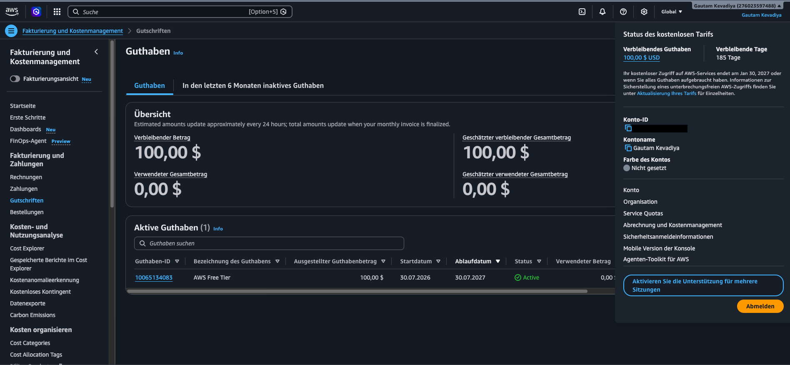

# Assignment 1 — AWS Free Tier Account Setup (EpicReads Cloud Onboarding)

Part of the DevOps Micro Internship (DMI) Cohort 3 with Agentic AI

---

## Purpose

In this assignment, you will create and verify an AWS Free Tier account as part of onboarding EpicReads — an online bookstore moving to the cloud. You will demonstrate an understanding of AWS fundamentals, Free Tier services, and account setup by answering conceptual questions and capturing proof of a working AWS Console login.

---

# Task 1 — Understanding AWS & Free Tier

## Goal

Demonstrate understanding of AWS basics and Free Tier usage by answering the following questions in your own words (3–4 lines each).

### Answers

#### Question 1 — What is an AWS account, and why do you need it at this stage?

An AWS account is your entry point into Amazon Web Services—it's the container that holds all your cloud resources (servers, storage, databases, etc.) and ties usage to a billing identity. It's tied to an email address and payment method, and it gives you access to the AWS Management Console, APIs, and CLI tools to create and manage cloud infrastructure.

A few key things about what it actually is:

A billing and identity boundary — everything you spin up (virtual machines, storage buckets, databases) gets billed to this account, and access is controlled through it via IAM (Identity and Access Management).
A root identity — the account has a root user with full permissions over everything in it. Best practice is to avoid using the root user for daily work and instead create separate IAM users/roles with limited permissions.
Free-tier eligible — new accounts typically get access to a free tier (limited amounts of compute, storage, etc. for 12 months, plus some always-free services), which is often enough to experiment or build a small project.

As for why you'd need one "at this stage" — I don't have the earlier context of what stage you mean (a course, a project, a job prep checklist, etc.). Generally, you need an AWS account as soon as you want to actually deploy or test something on real infrastructure rather than just reading about it—for example:

Following a hands-on tutorial that has you launch an EC2 instance or S3 bucket
Deploying a personal project or portfolio site
Practicing for an AWS certification with real services
Testing how your application behaves in a cloud environment rather than locally

---

#### Question 2 — What is AWS Free Tier, and how long does it last?

AWS Free Tier is a program that lets you use a limited amount of many AWS services at no cost, so you can learn the platform or build small projects without a bill showing up. It comes in three types, which is the part people often miss:

12 months free — a set quota of specific services (like a certain number of hours of a small EC2 server, or a certain amount of S3 storage) that's free only during your first 12 months after signing up. After that, you pay standard rates for any usage.
Always free — a smaller set of services with limits that don't expire, available even after your first year (e.g., a limited amount of Lambda function calls per month).
Trials — short-term free offers (days or weeks) for certain services that start whenever you first activate that particular service, independent of your account age.

A few practical notes:

The 12-month clock starts from your account creation date, not from when you first use a service.
Free tier limits are usage caps, not spending caps — if you go over the free allotment (e.g., run more EC2 hours than included), you get charged for the overage, not blocked.
It's easy to accidentally leave something running (like an EC2 instance) and rack up charges once free tier hours run out, so it's worth setting up billing alerts early.
AWS also offers a "Free Tier usage alert" and a billing dashboard where you can track exactly what you've used.

---

#### Question 3 — Name three AWS Free Tier services and their free usage limits.

1. AWS Lambda (compute) — Always Free, regardless of account age. You get 1 million free requests per month, and this allowance never expires as long as your account exists. 
CostBench

2. Amazon DynamoDB (database) — Also Always Free. You get 25 GB of storage per month at no cost, permanently. 
CostBench

3. Amazon EC2 (virtual servers) — This one depends on when you created your account:

Legacy accounts (created before July 15, 2025): 750 hours per month of t2.micro instances (or t3.micro where t2.micro isn't available), free for your first 12 months only. 
OneUptime
New accounts (created on/after July 15, 2025): instead of 12 months of free EC2, you get upfront credits — $100 automatically, plus up to $100 more for completing onboarding tasks like launching an EC2 instance or deploying a Lambda function, for $200 total. Those credits apply toward EC2 usage (and other services) until they run out, within six months of account creation or when the credits are exhausted, whichever comes first.

---

# Task 2 — Create AWS Free Tier Account

## Goal

Create a valid AWS Free Tier account and sign in to the AWS Management Console.

> No screenshots required for this task. Completion is verified through Task 3.

---

# Task 3 — Verify AWS Account

## Goal

Confirm that your AWS account setup is complete by navigating to the Account section and capturing proof.

### Evidence

#### Screenshot 1 — AWS Account page showing account name (email may be blurred)

---
‚
# Submission Instructions

- Add all required screenshots in your GitHub repository submission
- Full name must be visible in required screenshots
- Do not expose sensitive information (keys, passwords, account IDs)

---

# Completion Checklist

- [x] Task 1 answers written in own words
- [x] AWS Free Tier account created successfully
- [x] Signed in to AWS Management Console
- [x] Screenshot of AWS Account page captured (full name visible, no sensitive data)
- [x] All required screenshots added to repository

---

## 📌 About DMI & CloudAdvisory

DevOps Micro Internship (DMI) is a project-based DevOps program run by Pravin Mishra (The CloudAdvisory) focused on real-world execution, systems thinking, and career readiness.

It helps learners build strong DevOps foundations with hands-on experience.

---

## 📌 Resources

- 🌐 DMI Official Website: https://dmi.pravinmishra.com?utm_source=github&utm_medium=readme  
- 🎓 University: https://university.pravinmishra.com?utm_source=github&utm_medium=readme  
- 💬 Discord Community: https://discord.pravinmishra.com?utm_source=github&utm_medium=readme  
- 📝 Blog: https://dmi.pravinmishra.com/blog?utm_source=github&utm_medium=readme  
- ▶️ YouTube Playlist: https://www.youtube.com/playlist?list=PLFeSNDtI4Cho  
- 🔗 Pravin Mishra (LinkedIn): https://www.linkedin.com/in/pravin-mishra-aws-trainer/  
- 🏢 CloudAdvisory (LinkedIn): https://www.linkedin.com/company/thecloudadvisory/

---

*This submission is part of DevOps Micro Internship (DMI) Cohort 3 — Agentic AI Track.*